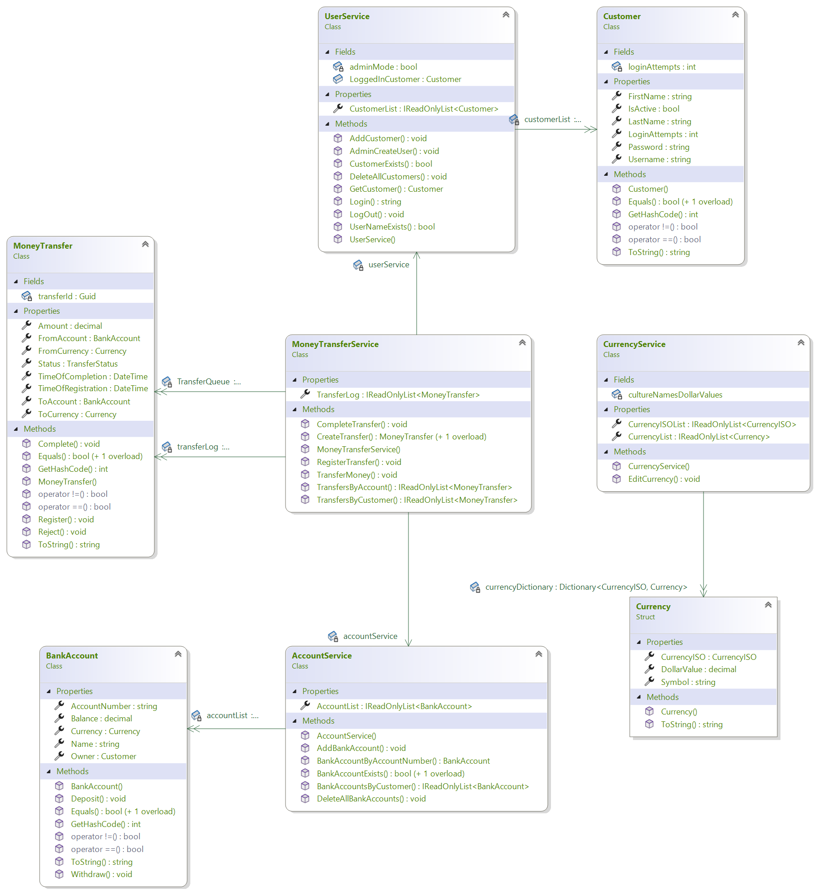
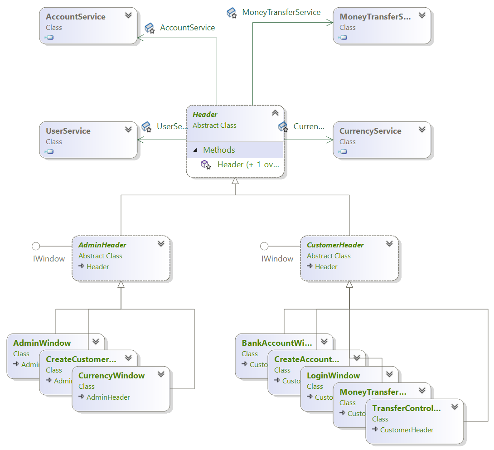

# Bank Project

**Our bank-solution has 3 Projects:**
- RabbitEyeBank is a library with all business logic.
- LoginDemo has the UI built in Spectre.Console.
- RabbitEyeTests contains the unit tests covering the business logic.

## RabbitEyeBank-Project

The library is built around a much simplified adaptation of the _Controller-Service-Repository_ pattern. Following this pattern means you have _Repository_ classes that stores and fetches one kind of entity. A UserRepository would handle User classes and only that. A _Service_ class manages the business logic, that is the creation and manipulation of the data classes and communicates with the outside world via controller classes. A service class might be wired into one or more repository classes depending on purpose. 

For example: EmailService could use a UserRepository and a AddressRepository for example. A _Controller_ would be the interface between the service classes and the outside world.
In this project the service classes acts as both service, repository and controller at the same time.

UserService and CurrencyService are quite straightforward. UserService handles customer creation and login verification/validation and authorization. CurrencyService stores the available currencies and their exchange rates. Exchange calculation is executed here when transferring money or changing currency on a bank account (Not yet implemented).

AccountService takes care of bankaccount storage and bankaccount creation (not implemented yet).
All customers are connected with their bank accounts by the `Owner` field in the bank account class, instead of the other way around.

MoneyTransferService manages both kinds of money transfers, intra-customer and between two different customers bank accounts. The transfers are handled in order of registration by a first-come-first served queue. Right now the transfer requests are served immediately but facilities for a timed execution are in place but not implemented.

## Console Application

The User interface is a console application built with [Spectre.Console](https://spectreconsole.net/), as we wanted to focus on the business logic and get the hassle of writing type-safe Console.Readlines out of the way as much as possible.

The rendering and navigation is built around a concept of "windows", one for each context. These are simply classes that implements the interface `IWindow` with the sole method `Show()`. These windows are handled by a stack-based window-manager. The stack keeps the last window visited on top of the stack so when the current windows `Show()` method returns, the former window is popped and it's `Show()` method executes. This mitigates the risk of getting entangled in longer and longer chains of method calls and conditional jumps.

## Unit Test Project

This is a unit test project built with XUnit that comes bundled with Visual Studio. The test coverage so far is minimal.

### Other dependencies
- Serilog for logging.
- Bogus for populating the lists with autogenerated entities.

### Diagrams

#### Service and entity class relations

#### Window and service class relations

